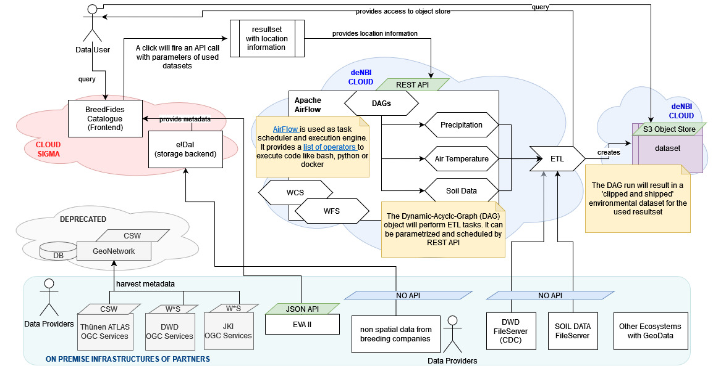

# composition
Docker Compositions for the BreedFides Repositories

How to use:

1. build airflow container
    - clone https://github.com/breedfides/airflow-etl
    - build locally as breedfides/airflow-etl:latest `docker build . -t breedfides-etl/airflow:latest`
2. clone composition
    - clone this repository
    - copy sample.env to .env
    - change .env variables to match your setup
3. run composition
    - `docker compose up`

# architecture overview

This composition will host the apache airflow component as shown above. 

# containers
## postgres

The postgres container is based on the main postgres image. It will mount the `initdb-airflow.sh` file and execute it at startup. This will create the airflow database and user.

## airflow-etl container

The airflow container is based on https://github.com/breedfides/airflow-etl. It will run on port 8080. At startup the `airflow initdb` and `airflow users create` function will get executed to initialize the airflow database. It will wait for the db container to be healthy before starting.

### S3 storage configuration

To get the S3 writing enabled a Amazon Web Service configuration needs to get created. As airflow admin those connections can be created at: 

AIRFLOW-URL/connection/list/

- connection id: aws_breedfides_obs
- connection type: Amazon Web Services

    {
    "profile": "default",
    "aws_access_key_id": "ACCESS-ID",
    "aws_secret_access_key": "ACCESS-KEY",
    "endpoint_url": "https://openstack.cebitec.uni-bielefeld.de:8080"
    }

### activate DAGs

on startup all DAGs are inactive. Activate them at AIRFLOW-URL/home

## nginx

The nginx container is based on the main nginx image with slight changes to work as reverse proxy for the airflow container. It will use the nginx.conf at `docker/nginx/nginx.conf`. It will wait for the airflow container to be healthy before starting.

